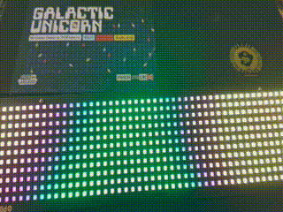

## Old school demo effects for Raspberry Pi Pico, Galactic Unicorn edition



Originally from [pico_effects](https://github.com/tuupola/pico_effects) by [@tuupola](https://github.com/tuupola)

If you cannot compile yourself build directory contains a [recent firmware](https://github.com/disq/galactic_effects/raw/master/build/firmware.uf2) for uploading to [Galactic Unicorn](https://shop.pimoroni.com/products/galactic-unicorn).

## Buttons

Volume buttons switch between effects.

Sleep button enables or disables auto switching of effects, which is set to 10 seconds and is enabled by default.

Brightness buttons control the brightness of the LEDs.

Double-click on the reset button puts the Unicorn in bootloader mode.

## Compile

Below instructions assume you do not have [Raspberry Pi Pico SDK](https://github.com/raspberrypi/pico-sdk) installed yet.

```
$ git clone --recursive https://github.com/raspberrypi/pico-sdk.git
$ git clone --recursive  https://github.com/disq/galactic_effects.git
$ cd galactic_effects/build
$ cmake ..
$ make -j8
```

If the SDK is already installed you can pass the installation path manually.

```
$ git clone --recursive  https://github.com/disq/galactic_effects.git
$ cd galactic_effects/build
$ cmake .. -DPICO_SDK_PATH=../pico-sdk
$ make -j8
```

You can then "flash" the firmware by putting the Galactic Unicorn into `BOOTSEL` mode and copying the uf2 file to the automatically mounted volume.

```
$ cp firmware.uf2 /run/media/<username>/RPI-RP2/
```

If you are using macOS the command would be the following.

```
$ cp -X firmware.uf2 /Volumes/RPI-RP2
```

Alternatively you can use picotool to flash the firmware.

```
$ picotool load firmware.uf2 -f
```
